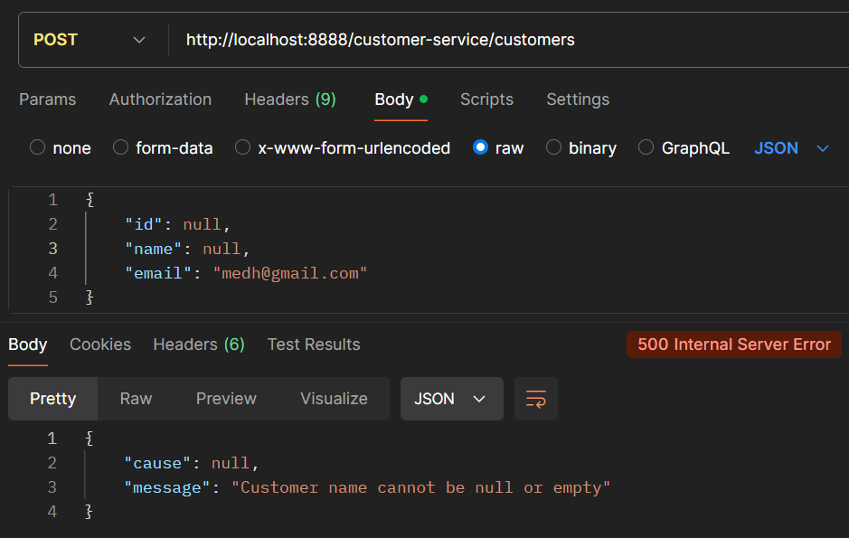

# Practical activity 2: Develop full microservice architecture using Spring cloud

## Part 1: Customer service, Inventory service, Discovery service and Gateway service

in this part we will develop 2 business microservice `customer-service` and `inventory-service`, and also 
2 technical microservices which are essential for microservice architecture, the first one is `discovery-service`,
and the second is `gateway-service`.

### Customer service

in the `customer-service` we need some usual dependencies:
- `Spring web`
- `Spring data jpa`
- `H2 database`
- `rest repositories`
- `lombok`

and other technical dependencies:
- `Eureka discovery client`
- `spring actuator`

#### Customer entity

```java
@Entity
@Getter @Setter
@AllArgsConstructor @NoArgsConstructor @Builder
@ToString
public class Customer {
    @Id
    @GeneratedValue(strategy = GenerationType.IDENTITY)
    private Long id;
    private String name;
    private String email;
}

```

#### CustomerRepository interface

```java
@RepositoryRestResource
public interface CustomerRepository extends JpaRepository<Customer, Long> {
}

```

notice that we use `@RepositoryRestResource` 
so all repository CRUD methods will be exposed at the endpoint: `/customers`


#### Repository event handler

we know that using `rest repositories`, there is no business layer or validation layer,
that check data rules before execute an CRUD action like saving a new customer,
here the `events handlers` comes, in order to add a simple business or validation layer,
to achieve that we should create a class annotated with `@RepositoryEventHandler`,
and each method member of this class can be handle one or more CRUD action,
`spring rest repositories` provide some annotation to handle a repository event, for example:
- `@HandleBeforeCreate`: the method is called before an entity be created for the first time.
- `@HandleBeforeSave`: the method called before an entity be updated
...

in order to validate a customer details before a customer be created or updated, we can do the following code:

```java
@Service
@RepositoryEventHandler
public class CustomerRepositoryEventHandler {

    @HandleBeforeSave
    @HandleBeforeCreate
    public void handleBeforeCreate(Customer customer) {
        
        if (customer.getName() == null || customer.getName().isBlank())
            throw new IllegalArgumentException("Customer name cannot be null or empty");

        if(customer.getEmail() == null || customer.getEmail().isBlank())
            throw new IllegalArgumentException("Customer email cannot be null or empty");
    }
}

```

notice that this class should be instantiated by spring, so `@Service` is added.

#### Setting up customer-service configuration

in `application.yml` file we add the following configs:

```yaml
spring:
  application:
    name: customer-service

  # database:
  datasource:
    url: jdbc:h2:mem:customer-db
  h2:
    console:
      enabled: true

  # rest repositories detection strategy:
  data:
    rest:
      detection-strategy: annotated

# port:
server:
  port: 8081

# resolve IP address from hostname:
eureka:
  instance:
    prefer-ip-address: true

```


also we need to expose the customer ids, in order to use those ids 
in `billing-service` microservice for reference a customer, 
which by default not exposed, for that we can create 
class configuration that will be implement `RepositoryRestConfigurer` interface, and
then override a method called `configureRepositoryRestConfiguration`:

```java
@Configuration
public class RestRepositoriesConfiguration implements RepositoryRestConfigurer {
    @Override
    public void configureRepositoryRestConfiguration(
            RepositoryRestConfiguration config, CorsRegistry cors) {
        config.exposeIdsFor(Customer.class);
    }
}
```

#### enroll some customers

```java
@Bean
    CommandLineRunner init(CustomerRepository customerRepository) {
        return args -> {
            Stream.of("karim", "hamza", "asmae")
                    .map(name -> Customer.builder()
                            .name(name)
                            .email(name+"@gmail.com")
                            .build()
                    )
                    .forEach(customerRepository::save);
        };
    }
```

### Inventory service

for the `inventory-service` we add the same dependencies as we do for `customer-service`:
- `Spring web`
- `Spring data jpa`
- `H2 database`
- `rest repositories`
- `lombok`
- `Eureka discovery client`
- `spring actuator`


#### Product entity

```java
@Entity
@Getter @Setter
@AllArgsConstructor @NoArgsConstructor @Builder
@ToString
public class Product {
    @Id
    @GeneratedValue(strategy = GenerationType.IDENTITY)
    private Long id;
    private String name;
    private double price;
    private int quantity;
}
```

#### ProductRepository interface

```java

@RepositoryRestResource
public interface ProductRepository extends JpaRepository<Product, Long> {
}

```


#### ProductRepositoryEventHandler

```java
@Service
@RepositoryEventHandler
public class ProductRepositoryEventHandler {
    
    @HandleBeforeCreate
    @HandleBeforeSave
    public void handleSaveProduct(Product product) {

        if(product.getName() == null || product.getName().isBlank())
            throw new IllegalArgumentException("Product name cannot be empty");

        if(product.getPrice() < 0)
            throw new IllegalArgumentException("Product price cannot be negative");

        if(product.getQuantity() < 0)
            throw new IllegalArgumentException("Product quantity cannot be negative");
    }
}

```

#### Inventory-service configs

in the `application.yml` file:

```yaml
spring:
  application:
    name: inventory-service

  # database connection:
  datasource:
    url: jdbc:h2:mem:product-db

  h2:
    console:
      enabled: true

  # rest repositories detection strategy:
  data:
    rest:
      detection-strategy: annotated

# server:
server:
  port: 8082

# register microservice with IP address:
eureka:
  instance:
    prefer-ip-address: true
```

the same thing with `Product` class, we need to expose the ids, 
for use then externally by `billing-service` for reference a product:

```java
@Configuration
public class RestRepositoriesConfiguration implements RepositoryRestConfigurer {

    @Override
    public void configureRepositoryRestConfiguration(
            RepositoryRestConfiguration config, CorsRegistry cors) {
        config.exposeIdsFor(Product.class);
    }
}
```

#### Save some products

```java
@Bean
    CommandLineRunner start(ProductRepository productRepository) {
        return args -> {
            Stream.of("Dell latitude 7450", "HP elite book 640", "Google pixel 9")
                    .map(name -> Product.builder()
                            .name(name)
                            .price(1000 + Math.random() * 3000)
                            .quantity((int) (2 + Math.random() * 10))
                            .build()
                    )
                    .forEach(productRepository::save);
        };
    }
```


### Discovery service

in this technical microservice, which is an essential part of `micorservice architecture`, 
where all microservices are registered, which help `gateway` or other microservice to locate the
appropriate microservice which will contact.

in this service we need the essential dependencies:

- `Eureka server`: to create a discovery server where all other parts are registered.
- `Spring actuator`: to used for monitoring purposes, such as checking discovery server health.


#### Configuration

```yaml
spring:
  application:
    name: discovery-service
eureka:
  client:
    # prevent server self registration:
    register-with-eureka: false
    # server does need to pull periodically registered ms:
    fetch-registry: false

# occupation port:
server:
  port: 8761


```

and also to activate eureka server functionalities, we add `@EnableEurekaServer` annotation 
to our spring boot application:

```java
@SpringBootApplication
@EnableEurekaServer
public class DiscoveryServiceApplication {

    public static void main(String[] args) {
        SpringApplication.run(DiscoveryServiceApplication.class, args);
    }

}

```


### Gateway service

the `gateway-service` is crucial in microservice architecture, 
the gateway represent the application router, his role is to route client requests to 
the appropriate microservice, taking in account load balancing to perform better 
availability.

in this small microservices we need three dependencies:
- `Eureka discovery client`: in order to resolve microservices location (address and ports).
- `Spring actuator`: for monitoring purposes.
- `Spring cloud reactive gateway`: provides gateway functionalities.


#### gateway configurations

in `application.yml` file:

```yaml
spring:
  application:
    name: gateway-service

  # activate discovery locator functionalities
  # So it will fetch registered microservice
  # from eureka server.
  cloud:
    gateway:
      discovery:
        locator:
          enabled: true
          lower-case-service-id: on

# occupation port:
server:
  port: 8888

# register to eureka with IP address:
eureka:
  instance:
    prefer-ip-address: true

```

so our gateway is ready.

### Testing

after starting up all previous services, we can now test if our architecture work well.

#### Get all customers from customer-service


#### Create new customer


when we use `Repository events handlers` we can validate data before save it, let suppose that
the customer name sent with `null` value, the customer doesn't be created:



also if we try to update a customer details with unacceptable data the `repository event handler` will reject the request.


#### Get all products from inventory-service


#### create product


and the validation layer based on `repository event handler` is present, so
for example if the product price is `negative` the request will be rejected:


## Part-2: Develop billing-service

### Entities

in this microservice, we manipulate two entities:
- `Bill`:
```java
@Entity
@Getter @Setter
@AllArgsConstructor @NoArgsConstructor @Builder
@ToString
public class Bill {
    @Id
    @GeneratedValue(strategy = GenerationType.IDENTITY)
    private Long id;
    private LocalDateTime billingDate;
    private Long customerId;

    @OneToMany(mappedBy = "bill")
    private List<ProductItem> productItems;
}
```

- `ProductItem` :

```java
@Entity
@Getter @Setter
@AllArgsConstructor @NoArgsConstructor @Builder
@ToString
public class ProductItem {
    @Id
    @GeneratedValue(strategy = GenerationType.IDENTITY)
    private Long id;
    private double price;
    private int quantity;
    private Long productId;
    @ManyToOne
    private Bill bill;
}

```

### Rest Repositories

#### BillRepository

```java
@RepositoryRestResource
public interface BillRepository extends JpaRepository<Bill, Long> {
}

```

#### ProductItemRepository

```java
@RepositoryRestResource
public interface ProductItemRepository extends JpaRepository<ProductItem, Long> {
}

```

### Models

models are utils, when we need to represent a classes those are manipulate 
by an external service, for example in this service, we need to get customer details that fetched from
`customer-service`, so we need a vesel where to put those details, the same thing for products which 
manipulated by `inventory-service`: 

```java
public record Customer(
        Long id,
        String name,
        String email
) {}

```

```java
public record Product(
        Long id,
        String name,
        double price
) {}

```

we notice that those object will be immutable, that is why the most appropriate types are  `records`. 

### DTOs (Data Transfer Object)

with `rest repositories` we already can consult the information about `Bills` and `ProductItems`,
but we don't have access to `customer` or `product` details,
using DTO we can achieve that, `BillDTO` and `ProductItemDTO` looks like:

```java
public record BillDTO(
        Long id,
        LocalDateTime billingDate,
        Customer customer,
        List<ProductItemDTO> productItems
) {
}
```

```java
public record ProductItemDTO(
        Long id,
        double price,
        int quantity,
        Product product
) {}
```

we notice that those object will be immutable, that is why the most appropriate types are  `records`. 

### Rest clients using openFeign

in order to fetch `customer` and `product` details from 
`customer-service` and `inventory-service` respectively
 we use `OpenFeign`:

```java
@FeignClient(name = "customer-service")
public interface CustomerRestClient {

    @GetMapping(path = "customers/{id}")
    Customer getCustomer(@PathVariable  Long id);

    @GetMapping(path = "customers")
    PagedModel<Customer> getCustomers();
}
```

```java
@FeignClient(name = "inventory-service")
public interface ProductRestClient {

    @GetMapping(path = "products/{id}")
    Product getProductById(@PathVariable  Long id);

    @GetMapping(path = "products")
    PagedModel<Product> getProducts();
}
```

we notice that the openFeign should be enabled using `@EnableFeignClients`.

### Mappers

for the mapping framework we use `MapStruct`, which easy to use and provide powerfull mapping feature, and can 
be integrated with `spring` and open for dependency injection.

Here we define two mappers:
- `ProductItemMapper`:
```java
@Mapper(componentModel = "spring", uses = {ProductRestClient.class})
public interface ProductItemMapper {
    
    @Mapping(source = "productId", target = "product")
    ProductItemDTO mapProductItem(ProductItem productItem);
}

```
- `billMapper`:
```java
@Mapper(componentModel = "spring",
        uses = {CustomerRestClient.class, ProductItemMapper.class})
public interface BillMapper {

 @Mappings({
         @Mapping(source = "customerId", target = "customer"),
         @Mapping(source = "productItems", target = "totalPrice")
 })
 BillDTO mapBill(final Bill bill);

 /**
  * calculate the total price of bill:
  * @param productItems: Product item list
  * @return totalPrice
  */
 default Double calculateTotalPrice(final List<ProductItem> productItems) {
  return productItems.stream().mapToDouble(ProductItem::getPrice).sum();
 }
}
```

### BillRestController

```java
@RestController
@RequestMapping(path = "/bill-details")
@RequiredArgsConstructor
public class BillRestController {

    private final BillRepository billRepository;
    private final BillMapper billMapper;


    @GetMapping(path = "{id}")
    public ResponseEntity<?> getBillById(@PathVariable Long id) {

       try {
           BillDTO billDTO = billRepository.findById(id)
                   .map(billMapper::mapBill)
                   .orElseThrow(() -> new UnresolvedResourceException("bill"));

           return ResponseEntity.ok(billDTO);
       }catch (Exception exception){
           return ResponseEntity.status(HttpStatus.NOT_FOUND)
                   .body(exception.getMessage());
       }

    }

    @GetMapping(path = "of-customer/{id}")
    public ResponseEntity<?> getBillByCustomerId(@PathVariable Long id) {
        try {
            List<BillDTO> billDTOS = billRepository.findByCustomerId(id)
                    .stream()
                    .map(billMapper::mapBill)
                    .toList();
            return ResponseEntity.ok(billDTOS);
        }catch (Exception exception){
            return ResponseEntity.badRequest()
                    .body(exception.getMessage());
        }
    }

}

```


## Part-3: Front end with Angular

### Results


